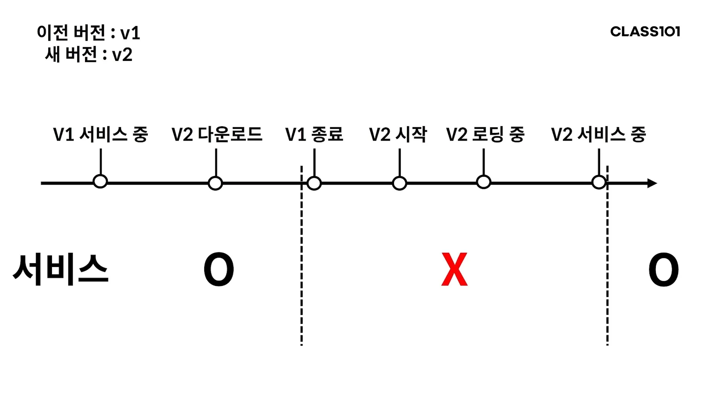
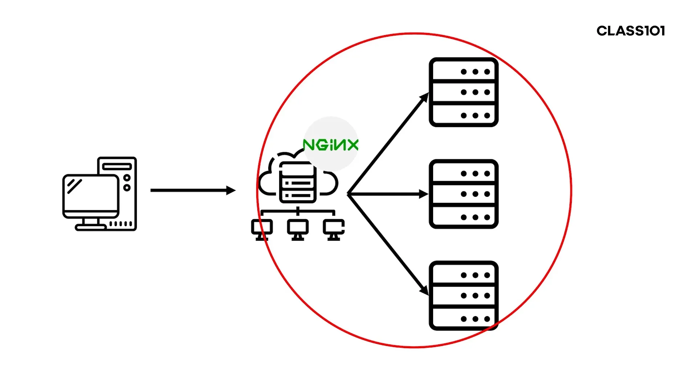

# 무중단 배포
 : Nginx를 이용하여 무중단 배포 환경 구성하기

## 개념
 - 배포?  
  : 새로 개발된 코드를 패키징하여 서버에서 새로운 버전의 애플리케이션을 실행하도록 하는 행위  
 ### 무중단 배포?  
  : 배포를 중단없이 진행한다는 의미

  - 배포되는 동안 애플리케이션은 언제 중단이 되는가?  
  : 다운타임(downtime)동안  
  : 이전 애플리케이션을 종료시키고, 새로운 애플리케이션을 실행 후 요청을 받을 준비(트래픽을 받을 준비)가 될 때까지 서비스가 중단되는 시간  

 - 무중단 배포를 하기 위한 방법  
  : 애플리케이션 서버와 사용자 사이에 중계 해줄 서버가 필요  
  : 중계 서버로 리버스 프록시(Reverse Proxy)를 둔다.  
    * 프록시?  
     : '대리자'라는 의미로, 사용자가 애플리케이션 서버의 서비스를 받기 위해서 Forward Proxy에 요청을 하고, 포워드 프록시서버가 애플리케이션으로부터 결과를 받아서 클라이언트에 전달(forward) 해 준다.  
     => 서버가 사용자를 특정 할 수 없도록 **사용자를 숨긴다.**  
     => 사용자1,사용자2,...사용자N - 프록시 - 서버
    * 리버스 프록시?  
     : 사용자가 리버스 프록시(Reverse Proxy)에게 요청을 보내면 리버스 프록시는 해당 요청의 결과를 내부 서버로부터 데이터를 받은 후 이 데이터를 사용자에게 다시 전달한다.
     => 사용자가 서버를 특정하지 않고 이용할 수 있도록 **서버를 숨긴다.**  
     => 사용자는 서버의 갯수만큼 IP또는 도메인 주소를 알고있지 않아도 서비스 이용이 가능하다.  
    * [포어드 프록시 VS 리버스 프록시](https://www.lesstif.com/system-admin/forward-proxy-reverse-proxy-21430345.html)

 ### 리버스 프록시로 부하 분산  
 : 트래픽 분산이 가능해짐  
∵ 클라이언트는 애플리케이션 서버를 모르기 때문.  
=> 이렇게 트래픽을 분산하여 각 서버가 받는 부하를 분산하는 것을 '로드밸런싱(Load balancing)'이라고 한다.  
ex > Nginx, HAProxy    
[로드 밸런싱에 대한 읽어 볼만한 게시물](https://d2.naver.com/helloworld/284659)  

### 여러가지 배포 방식
 
 - 롤링(Rolling)배포,
 - 블루 그린(Blue Green)배포
 - 카나리(Canary) 배포  
 
 [각 배포 방식별 설명](https://reference-m1.tistory.com/211)

-----
### 여기서 궁금한 점
#### **트래픽이 매우 많아져도 Ngingx만으로 충분할까?**  
=> No!  
아무리 스케일 아웃으로 애플리케이션 서버의 수가 많아져도 결국, 트래픽은 Nginx 서버를 거쳐가고 Nginx 서버에서 처리할 수 있는 용량에도 한계가 있다.  
#### How To Do?
1. Nginx가 실행되는 서버 Scale-up
 : 서버의 성능을 높인다
2. 네트워크 장치로 로드 밸런싱
 : Nignx와 같은 S/W가 아닌 H/W적으로 로드밸런싱( ex. [L4/L7스위치](https://velog.io/@makeitcloud/%EB%9E%80-L4-load-balancer-vs-L7-load-balancer-%EB%9E%80))
3. DNS 리다이렉션
 : 특정 사이트의 도메인을 입력하면
  -  해당 도메인은 DNS 서버로 가서 해당 도메인에 매칭되는 IP를 받아온다.
  - 이 IP로 접속 해야 할 서버가 어딘지 알게 된다.
  ** 이때 하나의 도메인에 여러개의 IP를 설정하는 것.
    - 이떄 설정하는 IP는 로드밸런서의 IP
    - 로드 밸런서를 여러개 두고 DNS에서도 각 로드밸런서로 요청을 분산시켜주면 각 로드밸런서가 받아야 할 트래픽이 줄어든다.
   
#### **롤링으로 배포하다가 배포에 실패하면 어떻하지?**
 : 이전 버전으로 롤백 시키고 배포가 실패한 원인 찾기.
 - 대부분 코드에 원인이 있을 것이다.
 * 배포 성공 여부 체크하는 존재 필요.
    - 배포 스크립트 자체에 포함
    - 새로 배포된 서비스에 특정 API 요청을 했을 때 올바른 응답이 오는지 체크하는 제3의 서비스를 이용
  * 롤백 수단
    - 수동롤백
    - 자동롤백

### Session 관리는 어떻게?
예를 들어 로그인 세션을 가지고 있는 Application 서버가 종료되면 다른 서버가 살아 있다고 하더라도 서비스의 문제가 될 것 같습니다.  
-> 이 부분은 WAS에서 기본으로 제공하는 세션쿠키-세션을 사용하면 안됩니다. 대안은 여러가지가 있는데요, JWT를 사용하는 방법도 있고, Redis 같은 공용 세션 저장소를 두고 세션을 확인하는 방법도 있습니다.
JWT는 문자열 자체에 인증 정보를 포함하고 있기 때문에 다른 애플리케이션에서 발급된 JWT라도 인증에 사용할 수 있습니다.
그리고 Redis 같은 공용 세션 저장소를 사용하는 경우 성능이 문제되지 않을까? 싶을수도 있지만, Redis에 데이터를 읽고 쓰는건 매우 빠릅니다. TPS 천단위가 기본이에요.
이 외에도 여러 애플리케이션 사이에 세션을 공유해주는 방법은 더 있습니다. 검색해보시면 많이 나올거에요!  
[참고](https://hyuntaeknote.tistory.com/6)

2. 무중단 배포가 불가능한 경우도 있나요?  
얼핏 드는 생각으로는 테이블 스키마가 변경되는 경우 상황에 따라서 「전체 서비스를 중단 -&gt; DB 스키마 변경 -&gt; 다시 시작」 이렇게 해야될 것 같은데요. 실무에서는 무중단 배포가 불가능한 상황이 있나요?  
-&gt; 무중단 배포가 불가능한 상황이 있습니다. 일단 말씀해주신 스키마 변경 정도는 보통 중단이 필요하진 않아요. (물론 일반적인 경우를 말하는거지 스키마가 엄청나게 변경되는 경우 중단이 필요할 수도 있습니다.)  
가장 무중단 배포가 불가능한 상황은 주로 **데이터 저장소와 관련된 작업**일 때입니다.  
A 저장소에서 B 저장소로 사용하는 저장소를 변경하는 마이그레이션을 해야하는 경우라면 보통 무중단으로 배포하기가 몹시 까다롭습니다. 이유는 무중단으로 배포하면 트레픽이 계속 A 저장소에 꽂히고 있을텐데, 이걸 B 저장소에 데이터를 옮기는 작업과 함께 변경된 데이터까지 반영시켜줘야하기 때문입니다. 이 작업이 정말 어려워요.

그래서 보통 다음과 같은 순으로 중단 배포합니다.

 1. 서비스를 중단하여 A 저장소로 유입되는 데이터 차단 
 2. A 저장소에서 B 저장소로 데이터 마이그레이션 
 3. B 저장소로 마이그레이션이 완료되면 애플리케이션에서 A 저장소가 아니라 B 저장소를 바라보도록 변경
 4. 서비스 시작

### L4 스위치, L7 스위치 추가 설명
L4 스위치와 L7 스위치는 Nginx와 비슷한 역할을 하지만, 근본적으로 다릅니다.  
Nginx는 결국 서버 위에 올라가고, 서버에서 돌아가는 애플리케이션에 불과합니다. 결국 서버에서 사용하는 리소스를 Nginx가 공유하여 사용하는 형태이기 때문에 트래픽을 처리하는데 온전히 모든 리소스를 사용할 수 없습니다. 또한 서버 자체는 트래픽을 처리하기 위해서만 존재하지 않습니다. 여러가지 범용적인 애플리케이션을 실행할 수 있도록 만들어져 있습니다.  
컴퓨터 과학은 거의 대부분 장점의 이면에는 트레이드 오프가 존재하는데, 범용적이라는 말은 '전문적'이지 않다는 것을 의미합니다. Nginx가 올라가 있는 서버 역시 범용적이지만, 전문적이지 않은겁니다.

여기까지 이해 되셨다면 L4 스위치와 L7 스위치에 대해 이야기 해보겠습니다. 일단 스위치라는건 네트워크 장비입니다. 결국 이 장비는 네트워크 트래픽을 '전문적'으로 처리합니다. 하지만 반대로 '범용성'은 떨어지겠죠.

L4와 L7라는건 Layer 4, 7을 의미하는데 여기서의 Layer는 OSI 7계층에서의 '계층'을 의미합니다.
(만약 OSI 7계층이 무엇인지 모른다면, OSI 7계층부터 검색해서 학습하고 읽으시는게 좋습니다.)

L4 스위치는 4계층에서 동작하는 스위치입니다. 그래서 유입되는 트래픽을 4계층까지만 확인하고 로드밸런싱합니다. (4계층이라는건 1,2,3 계층을 포함하고 있습니다.)
4계층에는 IP, Port는 포함되지만, URL 같은 데이터는 볼 수 없습니다. 그래서 L4 스위치는 IP, Port를 기준으로 로드밸런싱을 하도록 설정 가능합니다.

L7 스위치는 OSI 7계층 내에 있는 데이터 모두를 볼 수 있습니다.
여기에는 앞선 L4 스위치에서 다루던 IP, Port도 포함되고, HTTP Host 정보(도메인이라고 생각하셔도 됩니다), URL 등으로 어떤 서버로 로드밸런싱 할지 설정할 수 있습니다.

### Forward/Reverse Proxy 추가설명
관점의 차이라고 말씀하신 것도 맞는 말이지만, 좀 더 구체적으로 이야기를 해보겠습니다. 그러기 위해서 Forward와 Reverse 라는 말 자체에 집중해봅시다.
우선 Forward가 먼저 존재하던 프록시였습니다. 웹이 발달하면서, 여러 이유로 클라이언트는 자신의 존재를 숨길 필요가 생겼습니다. 그래서 여러 프록시 서버들이 생겨났습니다. 이제 사용자는 이 프록시 서버를 대리자로 세워서 자신의 존재를 숨긴체 서버로 요청을 할 수 있게 되었습니다.

그런데 이후 웹이 점점 발달하면서 사용자도 많아지니 더이상 물리적인 하나의 장비로는 사용자가 많은 서비스를 운영할 수 없게 되었습니다. 이제는 서비스를 위해 여러대의 서버를 운영할 필요성이 생겼습니다. 그런데 문제가 생겼어요. 서버가 여러대가 되면, ip 주소도 여러개가 되어야하고 각각의 domain 주소도 여러개가 되어야 할 수도 있었거든요. 그래서 나온게 로드밸런서 였습니다. 로드밸런서는 여러 서버들의 앞쪽에 위치하여 트래픽을 대신 받은 후 뒷쪽에 있는 서버들에게 골고루 전달하였습니다. 이제 사용자들은 각각의 서버 ip가 아니라, 로드밸런서의 ip와 domain 주소만 알면 됩니다. 그런데 로드벨런서를 보니 서버가 숨겨진 효과가 있는겁니다. 마치 프록시 같죠? 그런데 이번에는 클라이언트를 숨기는게 아니라 서버가 숨겨지므로, 기존의 프록시의 반대라는 의미로 Reverse Proxy라는 이름을 붙였습니다.

말씀하신대로 Forward와 Reverse는 결국 누가 숨겨지느냐의 차이입니다. 당연히 한쪽의 반대되는 존재가 숨겨지는 것이므로, 관점의 차이라고 말해도 이상하지 않습니다.
왜냐면 둘다 누가 숨겨지든간에 결국 '프록시'니까요.
 * tip> '관점' 보다는 프록시의 '역할'로 구분하면 좋다 

추가로 보충 설명 드리자면

1. 위에 설명드린 웹의 발달 과정은 실제 사실과 다른 부분이 있을 수 있습니다. 웹이 있기 전부터 로드밸런서 같은 개념은 존재했을겁니다.

2. 리버스 프록시를 로드밸런서 로서의 역할만 이야기 했지만, 리버스 프록시가 할 수 있는건 정말 여러가지입니다. Nginx의 기능들을 찾아보시면 됩니다. 대표적으로는 보안에 용이하다는 점이 있는데, 서버가 모두 외부에 노출되어 있으면 그만큼 각 서버의 보안을 관리하는게 쉽지 않습니다. 반면 리버스 프록시를 통해서만 서버로 접근이 가능하다면, 해당 리버스 프록시의 보안만 신경써도 많은 보안 취약점을 피할 수 있습니다. (네트워크 수준의 보안 취약점을 이야기하는 것이고, 결국 트래픽은 포워딩 되기 때문에 애플리케이션 관련 보안은 애플리케이션 서버에서 막아야합니다.)
